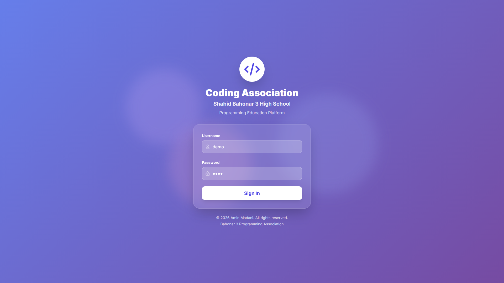
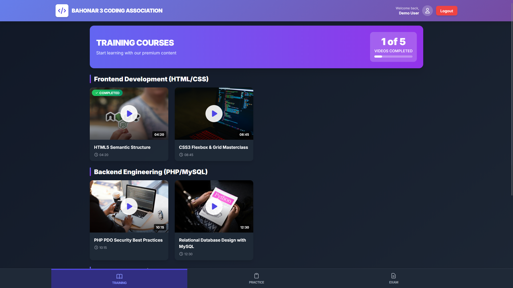
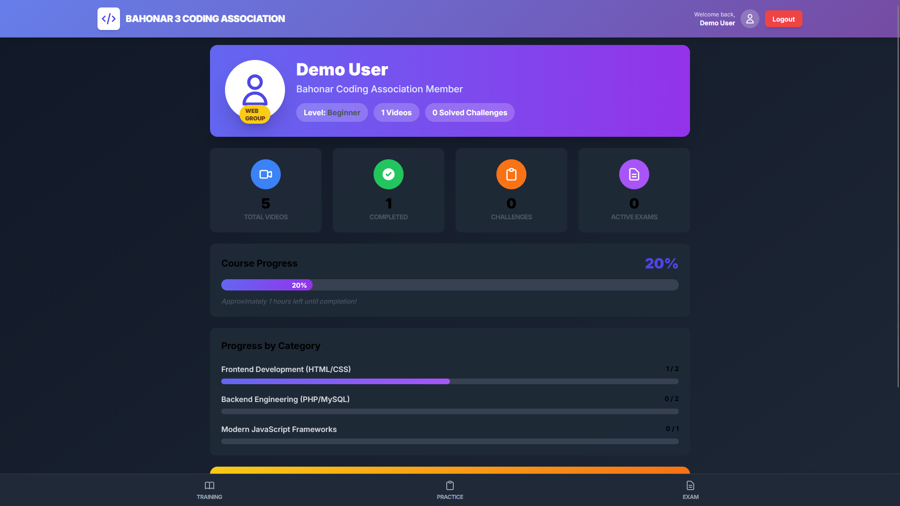

# Bahonar 3 Learning Platform

A modern, fast, and secure educational platform built with PHP and MySQL. This system features a dark-themed UI, group-based content access, and real-time progress tracking.

-----

## 🚀 Live Demo

You can explore the platform live at: **[learningpanel.aminmadani.xyz](https://learningpanel.aminmadani.xyz)**

**Demo Credentials:**

  * **Username:** `demo`
  * **Password:** `demo`

---

## 📸 Screenshots

### 1. Login Page
The entrance to the platform, featuring a clean, dark-themed interface with secure authentication.



### 2. Student Dashboard
The main hub where students can view their registered courses (groups), track overall progress, and access learning modules.



### 3. User Profile & Settings
A dedicated section for students to manage their personal information, view their current level, and earned points.



---

## ✨ Features

  * **Secure Authentication:** PDO-based login system with protection against SQL Injection.
  * **Group Access Control:** Content is filtered based on user groups (e.g., WEB, Group A, Group B).
  * **Progress Tracking:** Visual progress bars calculating watched vs. remaining content.
  * **Singleton Pattern:** Optimized database connection management.
  * **Responsive Dark UI:** Fully customized with TailwindCSS for a modern developer experience.

-----

## 🛠️ Installation & Setup

1.  **Clone the repository:**
    ```bash
    git clone https://github.com/aminmadaniofficial/LearningPanel.git
    ```
2.  **Database Setup:**
      * Create a new MySQL database named `bahonar3`.
      * Import the schema from `./database/schema.sql`.
3.  **Configuration:**
      * Copy `config.sample.php` to `config.php`.
      * Enter your database credentials in `config.php`.
4.  **Run:**
      * Move the folder to your `htdocs` or use a local server like XAMPP.

-----

## 📅 Roadmap (To-Do)

  - [ ] **Admin Dashboard:** Full GUI for managing users and uploading videos.
  - [ ] **Mentor Panel:** Dedicated space for instructors to review student exercises.
  - [ ] **Online Quiz System:** Automated multiple-choice tests after each module.
  - [ ] **Certificate Generation:** Automated PDF certificates upon course completion.
  - [ ] **Live Chat:** Real-time support for students within the panel.

-----

## 🤝 Contributing

Contributions are welcome\! If you have suggestions for new features or improvements, feel free to fork the repository and submit a pull request.

-----

## 📜 License

This project is licensed under the **MIT License**.

**Developed with ❤️ by Mohammadamin Madani**